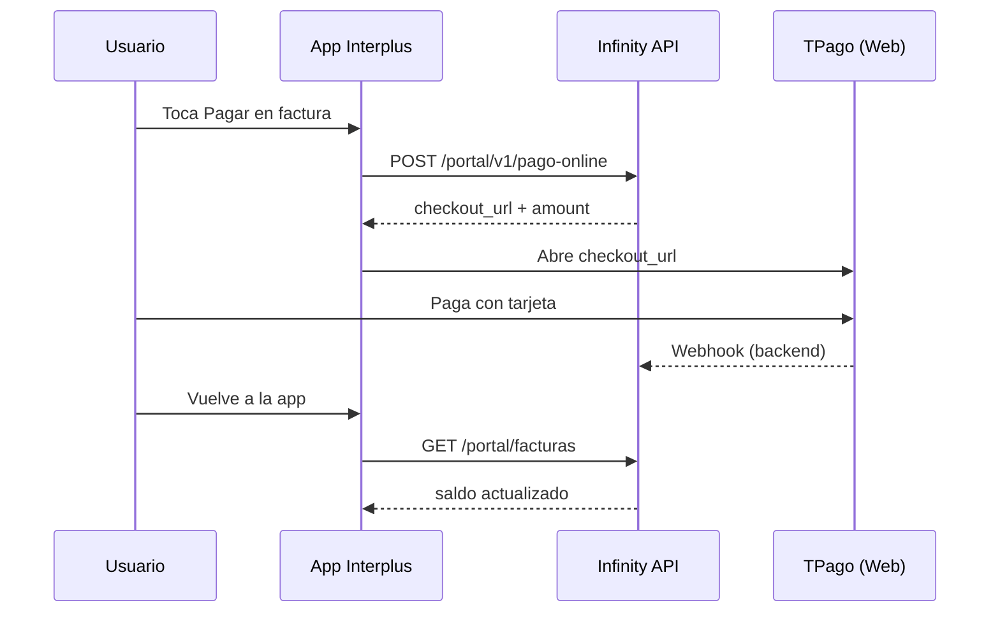

# App Interplus Clientes — Instrucción pago online (TPago)

Guía para implementar el botón **Pagar** / checkout con tarjeta en la app móvil.

Base API: `{BASE}/api/v1`  
Auth: `Authorization: Bearer {token}` (usuario portal / cliente)  
Permiso: `portal.cuenta.ver`

---

## 1. Objetivo UX

El cliente elige una factura con saldo → la app pide un link a Infinity → abre la página TPago → el usuario paga con tarjeta → al volver, la app refresca facturas/saldo.

**La app no procesa tarjetas.** Solo obtiene y abre `checkout_url`.

---

## 2. Feature flag

Antes de mostrar el CTA de pago:

```http
GET /portal/v1/feature-flags
```

Buscar items de métodos de pago (keys canónicas; la app también acepta aliases):

| Key | Alias | Acción en app |
|-----|-------|---------------|
| `pago_online` | `pago_tarjeta`, `tpago`, `bancard` | Sheet confirmar monto → POST pago-online |
| `pago_tigo_money` | `pago_tigo`, `tigo` | Modal con datos + WhatsApp |
| `pago_transferencia` | `transferencia`, `bank_transfer` | Modal cuenta + WhatsApp |
| `pago_qr` | `qr` | Modal (si hay datos / enabled) |

| `state` | Comportamiento en app |
|---------|------------------------|
| `enabled` | Mostrar casilla / modal |
| `coming_soon` | Mostrar “Pronto” (usar `label` o `metadata.badge`) |
| `hidden` | No mostrar |
| `auto` | Tratar como enabled (el backend suele resolverlo antes) |

Ejemplo tarjeta:

```json
{
  "key": "pago_online",
  "state": "enabled",
  "label": null,
  "metadata": {
    "title": "Tarjeta / TPago",
    "subtitle": "Pagar con tarjeta en línea",
    "sort_order": 10,
    "icon": "card",
    "provider": "TPago",
    "instructions": "Confirmá el monto y se abrirá el checkout seguro de TPago."
  }
}
```

Si `pago_online.state !== "enabled"`, **no** llamar a `/pago-online`.

**Íconos:** si `metadata.icon_url` viene con URL (`https://…/logo.png`), usarla en la casilla/modal. Si no, caer al ícono genérico `metadata.icon` (`card`|`tigo`|`qr`|`transfer`).

---

## 3. Flujo recomendado en la app

```
Home / Facturas
   │
   ├─ GET /portal/facturas?solo_pendientes=1
   │     → listar facturas con saldo_pendiente > 0
   │
   ├─ Usuario toca "Pagar" en una factura
   │
   ├─ POST /portal/v1/pago-online  { factura_interna_id }
   │     → data.checkout_url
   │
   ├─ Abrir checkout_url (navegador externo o Custom Tabs / SFSafariViewController)
   │
   ├─ Al volver a la app (onResume / scenePhase)
   │     → refrescar GET /portal/facturas y/o GET /portal/resumen
   │
   └─ Si saldo_pendiente == 0 → mostrar “Pago registrado”
```

### Diagrama



---

## 4. Endpoints

### 4.1 Facturas pendientes

```http
GET /portal/facturas?solo_pendientes=1&per_page=20
Authorization: Bearer {token}
```

Campos útiles por ítem:

| Campo | Tipo | Uso en UI |
|-------|------|-----------|
| `id` | int | Enviar como `factura_interna_id` |
| `saldo_pendiente` | number | Monto a mostrar (“A pagar”) |
| `total` | number | Total factura |
| `fecha_vencimiento` | date\|null | Vencimiento |
| `periodo_desde` / `periodo_hasta` | date\|null | Período |
| `estado` | string | Chip de estado |

Solo ofrecer pago si `saldo_pendiente > 0`.

### 4.2 Crear / reusar link de pago

**Preferido: POST**

```http
POST /portal/v1/pago-online
Authorization: Bearer {token}
Content-Type: application/json
Accept: application/json

{
  "factura_interna_id": 123
}
```

Saldo a favor (solo monto, sin factura):

```http
POST /portal/v1/pago-online
Authorization: Bearer {token}
Content-Type: application/json

{
  "amount": 50000
}
```

Respuesta con `purpose: "saldo_favor"` y `factura_interna_id: null`. El webhook TPago registra el cobro y suma saldo a favor del servicio.

También válido:

```http
GET /portal/v1/pago-online?factura_interna_id=123
```

#### Parámetros

| Nombre | Dónde | Obligatorio | Descripción |
|--------|-------|-------------|-------------|
| `factura_interna_id` | body o query | No* | ID de `GET /portal/facturas`. *Si se omite y no hay `amount`, el backend usa la primera factura con saldo. |
| `amount` | body o query | No | Monto en Gs. Solo (sin factura) → link de saldo a favor. |
| `force_new` | body o query | No | `true` / `1` fuerza un link nuevo (evitar en el flujo normal). |

**Recomendación app:** para pagar una factura, siempre enviar `factura_interna_id` de la fila que el usuario tocó.

#### Respuesta OK (`success: true`)

```json
{
  "success": true,
  "message": "OK",
  "data": {
    "checkout_url": "https://www.tpago.com.py:8888/links?alias=XXXX&…",
    "url": "https://www.tpago.com.py:8888/links?alias=XXXX&…",
    "payment_url": "https://www.tpago.com.py:8888/links?alias=XXXX&…",
    "provider": "tpago",
    "factura_interna_id": 123,
    "amount": 150000,
    "link_alias": "XXXX",
    "expires_at": "2026-08-07T15:31:30+00:00",
    "reused": false
  }
}
```

| Campo | Uso |
|-------|-----|
| `checkout_url` | **URL a abrir** (también vienen `url` y `payment_url` por compat) |
| `amount` | Monto del link en Gs (entero) |
| `factura_interna_id` | Factura asociada |
| `expires_at` | Expiración del link (ISO-8601); opcional mostrar |
| `reused` | `true` = se reutilizó un link vigente (mismo monto) |
| `provider` | `"tpago"` cuando está activo |

#### Errores

| HTTP | `success` | Qué mostrar |
|------|-----------|-------------|
| 422 | false | Mensaje de `message` (sin saldo, factura inválida, etc.) |
| 401 | false | Re-login |
| 502 | false | “No pudimos generar el link. Probá de nuevo.” |
| 200 con `checkout_url: null` y `tpago_ready: false` | true | Tratar como no disponible / coming soon |

Ejemplo 422:

```json
{
  "success": false,
  "message": "La factura no tiene saldo pendiente.",
  "errors": {
    "factura_interna_id": ["La factura no tiene saldo pendiente."]
  }
}
```

---

## 5. Cómo abrir el checkout

1. Validar que `checkout_url` empiece con `http`.
2. Abrir en **navegador externo** o Custom Tabs / Safari View Controller (mejor UX y 3DS).
3. No embeber en WebView inseguro si el SO bloquea pagos.
4. Mientras el usuario está fuera, no bloquear la UI: al volver, refrescar.

**No** enviar el Bearer token a TPago. El link ya es autosuficiente.

---

## 6. Después del pago

No hay deep link obligatorio de retorno de TPago. Al reenfocar la app:

1. `GET /portal/facturas?solo_pendientes=1` y/o `GET /portal/resumen`
2. Si la factura ya no aparece o `saldo_pendiente == 0` → éxito
3. Si sigue con saldo → “Si ya pagaste, puede demorar unos segundos. Tirar para actualizar.”

Opcional: botón “Ya pagué / Actualizar”.

El cobro lo registra el **webhook** del backend; la app solo lee el estado.

---

## 7. Copy / UI sugerida

- Botón en factura pendiente: **Pagar con tarjeta**
- Loading al pedir link: **Generando link de pago…**
- Confirmar monto antes de abrir (opcional): “Vas a pagar Gs {amount}”
- Flag `coming_soon`: usar `label` del flag o “Pago con tarjeta en camino”
- Error genérico: “No se pudo abrir el pago. Intentá nuevamente.”

Formato montos: guaraníes enteros, ej. `150.000` (locale `es-PY`).

---

## 8. Checklist de implementación

- [ ] Leer flag `pago_online` en Home / Facturas  
- [ ] Listar pendientes con `solo_pendientes=1`  
- [ ] CTA solo si `saldo_pendiente > 0` y flag `enabled`  
- [ ] `POST /portal/v1/pago-online` con `factura_interna_id`  
- [ ] Abrir `data.checkout_url`  
- [ ] Loader + manejo 422/502  
- [ ] Refresh al volver a la app  
- [ ] No guardar ni loguear el Bearer en URLs de TPago  

---

## 9. Sandbox (pruebas)

- Links de prueba apuntan a host `:8888` (ej. `https://www.tpago.com.py:8888/links?…`).
- Usuario de prueba TPago (suscripción / catálogo de tarjetas): ver mail de Bancard (`vpos_staging@bancard.com.py`).
- En **producción** el host del link cambia (sin `:8888`); la app no debe hardcodear el dominio: siempre usar `checkout_url` de la API.

---

## 10. Referencias backend

- Contrato técnico TPago: `docs/API_TPAGO.md`
- Portal 3.2: `docs/API_PORTAL_V320.md`
- Facturas portal: `docs/api-v1-movil.md` → sección facturas
